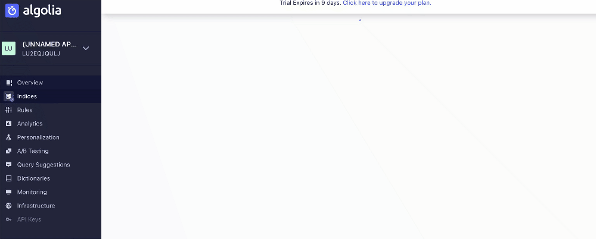

# Answers to Client Inquiries

## Question 1

Hello George,

many thanks for your questions. Please find explanations for each question below:

Records are objects (think of data entities) within an index. For example, each product in an index of all products of an e-commerce platform, would be a record.

Indexing is the process of adding data to an index. Within this process, the data is structured. This enables a search engine to find entities using the index in a much faster way then other search mechanisms on data.

Custom Rankings enable you to give a higher visibility to specific products. You could for example use popularity as a criteria to ensure that your most popular products rank higher.

Please let me know if any of these points are unclear and I will do my best to further explain them or schedule a call to go over them with you.

Thanks, Martin

## Question 2

Dear Matt,

many thanks for your feedback. We fully understand that the new UI can take time to get used to, however, as it was developed by a team of User Experience experts, we believe that it will help our clients to simplify and speed up their work flows.

To help you with the issue you've mentioned, I would like to point out our feature to delete multiple indecies at a time. Please see below GIF and its instructions to see how to do so.

1. Click on indices in the left panel.
1. Click on indices on the top of the page.
1. Click on "Select Page".
1. Check the boxes next to the indices you want to delete and click "Delete n Index".

Please let me know if this solves your issue.

Thanks, Martin

## Question 3

Hi Leo,

many thanks for reaching out to us regarding your interest in Algolia.

Integrating a new technology into an existing tech stack can be a challenging and resource intensive tasks. Because of this, Algolia has built its product with the developer in mind.

We are offering a full and up-to-date documentation, which you can find here [here](https://www.algolia.com/doc/).

Furthermore, we offer the following features to make the integration process as simple as possible:

- A full-featured dashboard to manage data and configurations.
- API clients for 11 languages (PHP, Ruby, JavaScript, Python, iOS, Android, C#, Java, Golang, Scala and Kotlin).
- A set of front-end libraries called InstantSearch, to help you implement Algolia on your website (vanilla JavaScript, React, Vue, Angular) or mobile application (iOS, Android).
- Integrations for frameworks, including Laravel, Symfony, Django and Rails.
- Extensions for Magento 1, Magento 2, Shopify, Salesforce Commerce Cloud, WordPress, Zendesk, Jekyll, and Netlify.
- An automated crawler to extract content from multiple sites and send it to Algolia.

Generally, the first step is to index your existing data and upload them to Algolia through our API or our Dashboard. As a second step you would then define your searchable attributes and customised ranking. Lastly the newly created search is implemented on your side by your development team. We offer templates for multiple languages to simplify this process.

This [video](https://www.youtube.com/watch?v=O3MXYm4m1OM&t=1s) lays out each step of the process.

In addition to this, I'm happy to schedule a meeting where I can take you through the process in a bit more detail and help you to establish an implementation plan.

Plesae let me know what your thoughts are.

Thanks, Martin
